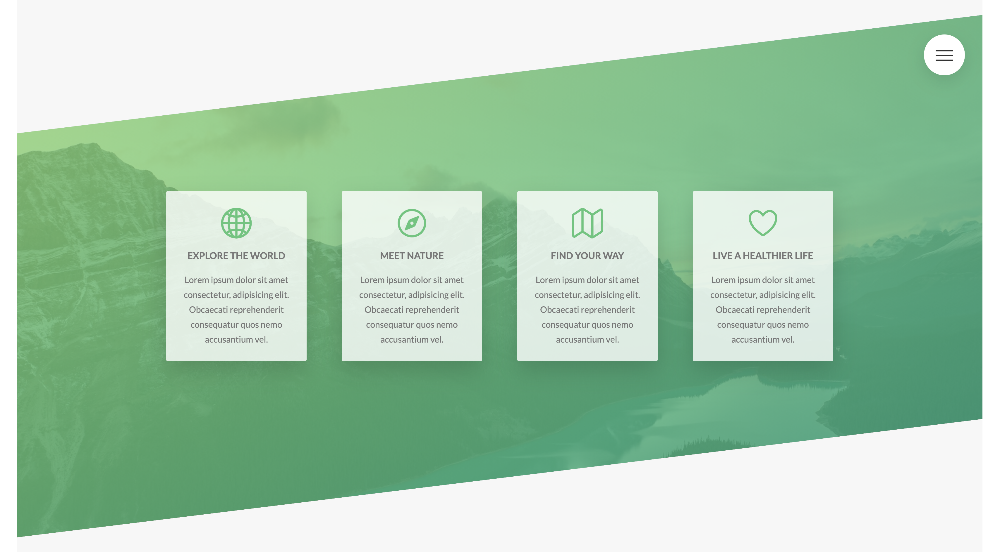
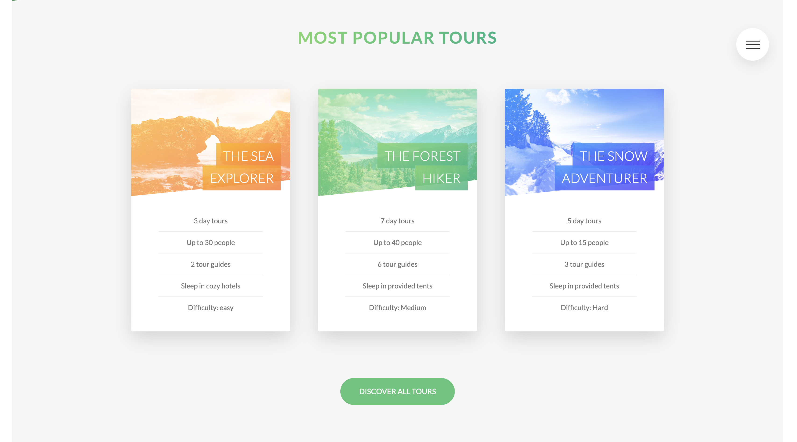
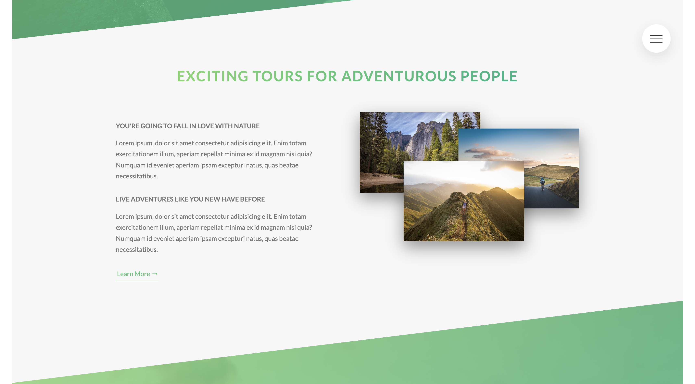

# Natour - A responsive tour booking web application

# Acknowledgement
This website was created while learning SASS and responsive web design through the course "Advanced CSS and Sass: Flexbox, Grid, Animations and More!" by Jonas Schmedtmann. The link to the course can be found [here](https://www.udemy.com/course/advanced-css-and-sass/?couponCode=BFCPSALE24).

# Description
Responsive design made with pure JavaScript, HTML, and SASS.

# Link
Preview the site by clicking [here](https://debiddo618.github.io/natours/).

# Screenshots

